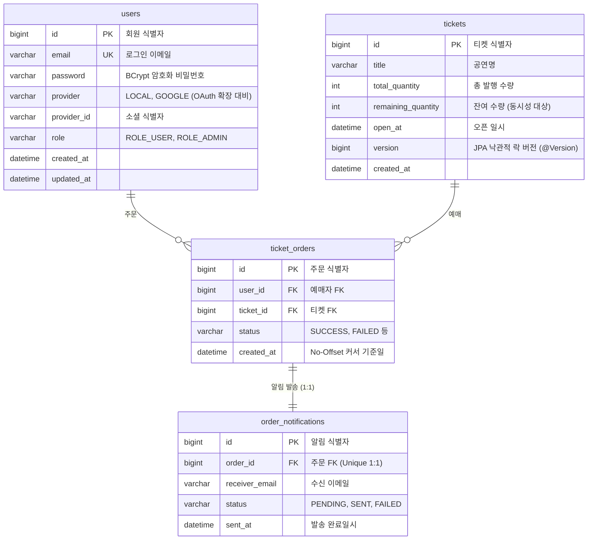
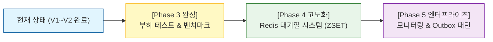

# 🎟️ Ticketing-Lab 프로젝트 기술 요약서 및 포트폴리오 백서

> **100만 건 대용량 데이터와 고트래픽 환경을 가정한 백엔드 성능 최적화, 동시성 제어 및 비동기 아키텍처 실험실**

---

## 📌 1. 프로젝트 개요 (Overview)

| 항목 | 내용 |
| :--- | :--- |
| **프로젝트명** | `Ticketing-Lab` |
| **프로젝트 성격** | 대규모 트래픽 및 대용량 데이터 환경에서의 백엔드 성능 튜닝, 동시성 제어, 분산 환경 정합성 실험 |
| **개발 인원 / 기간** | 개인 프로젝트 |
| **핵심 목표** | 1. **대용량 조회 최적화**: 100만 건 더미 데이터 환경에서 No-Offset 커서 페이징을 통해 Latency 0.1초 이하 유지<br>2. **동시성 정합성 보장**: 선착순 동시 예매 시 Race Condition을 Redis Redisson 분산 락으로 해결 (오버부킹 0% 정합성 검증)<br>3. **비동기 트랜잭션 격리**: 도메인 이벤트 기반 비동기 알림 처리 및 DB 커밋 연동(`@TransactionalEventListener`)<br>4. **보안 및 무중단 배포**: JWT RTR(Refresh Token Rotation) 및 Nginx 기반 Blue/Green 무중단 배포 자동화 |

### 🛠 기술 스택 (Tech Stack)

- **Language / Runtime**: Java 21
- **Framework**: Spring Boot 3.x, Spring Security 6, Spring Data JPA, QueryDSL (Jakarta)
- **Concurrency & Cache**: Redis, Redisson (Distributed Lock)
- **Database**: MySQL 8.0 (InnoDB)
- **CI/CD & Infra**: AWS EC2, Nginx (Reverse Proxy), GitHub Actions (Blue/Green Deployment)
- **Testing & Benchmark**: JUnit 5, Mockito, Spring Boot Test, (향후: Locust, Java 21 Virtual Threads)

---

## 🏛 2. 시스템 아키텍처 및 패키지 구조

본 프로젝트는 도메인 중심의 모듈화와 API 버전별(`v1`, `v2`, `v3`) 동시성/비동기 실험 분리를 위해 **Domain-Driven Package Structure**를 채택했습니다.

```text
com.ticketing.ticketing_lab
├── global                                 # [전역 공통 모듈]
│   ├── common                             # 공통 응답 규격(RsData), 100만 건 벌크 데이터 러너
│   ├── config                             # 외부 라이브러리 설정 (QueryDSL, Redis/Redisson, Async)
│   ├── error                              # 전역 예외 처리 (GlobalExceptionHandler, ErrorCode, BusinessException)
│   ├── health                             # Blue/Green 헬스체크 API (무중단 배포 스위칭 검증)
│   └── security                           # Spring Security 6, JWT 필터, RefreshToken(Redis)
│
└── domain                                 # [비즈니스 도메인 모듈]
    ├── user                               # [유저 도메인]
    │   ├── entity / enums / repository    # User, Role, UserRepository
    │   └── v1 (controller, dto, service)  # 회원가입, 로그인(HttpOnly 쿠키 발급), 토큰 재발급(RTR), 프로필 조회
    │
    ├── ticket                             # [티켓 도메인]
    │   ├── entity / repository            # Ticket (@Version 낙관적 락 포함), TicketRepository
    │   ├── v1 (controller, dto, service)  # 티켓 생성, 단건/페이징 조회 (RDB 기반)
    │   ├── v2                             # [V2: Redis 분산 락 실험]
    │   │   └── facade                     # RedissonLockTicketFacade (락 획득 후 트랜잭션 제어)
    │   └── v3                             # [V3: Message Queue / Redis 대기열 확장 예정]
    │
    ├── order                              # [주문 도메인]
    │   ├── entity / enums / repository    # TicketOrder, QueryDSL 커스텀 리포지토리(No-Offset 페이징)
    │   ├── event                          # OrderCreatedEvent (도메인 이벤트)
    │   └── v1 (controller, dto, service)  # 주문 생성 트랜잭션, No-Offset 커서 페이징 조회
    │
    └── notification                       # [알림 도메인]
        ├── entity / enums / repository    # OrderNotification, NotificationStatus
        ├── listener                       # OrderNotificationEventListener (@TransactionalEventListener)
        └── service                        # OrderNotificationService (REQUIRES_NEW 독립 트랜잭션), EmailService
```

---

## 💡 3. 핵심 아키텍처 진화 및 기술적 의사결정


### 1) 동시성 제어: AOP 어노테이션에서 Facade 패턴으로의 진화
- **초기 기획**: `@DistributedLock`과 같은 Spring AOP 커스텀 어노테이션을 만들어 서비스 메서드에 부착할 계획이었음.
- **발견된 문제점 (트랜잭션 커밋 전 락 해제 현상)**:
  `@Transactional`과 AOP 기반 분산 락이 같은 레이어에 존재할 경우, AOP 프록시 순서 문제로 인해 **락이 해제되는 시점이 실제 DB 트랜잭션이 커밋(Commit)되는 시점보다 앞서는 치명적인 Race Condition**이 발생할 위험이 있음. 스레드 A가 커밋하기 전에 락을 놓아버리면 스레드 B가 아직 반영되지 않은 재고를 읽어 갱신 분실(Lost Update)이 발생함.
- **최종 해결책 (`RedissonLockTicketFacade`)**:
    - `Facade 패턴`을 도입하여 **[락 획득 ➔ 별도 서비스의 트랜잭션 호출(시작/커밋 완료) ➔ 락 해제]** 순서를 코드 레벨에서 명확히 분리·보장함.
    - Spring EL 파싱 복잡성을 제거하고 디버깅 및 테스트 가시성을 극대화함.

### 2) 비동기 알림: `@EventListener`에서 `@TransactionalEventListener`로의 고도화
- **초기 기획**: 주문 완료 후 메일/알림 발송을 단순히 Spring Event + `@Async`로 분리.
- **발견된 문제점 (트랜잭션 롤백 시 데이터 불일치 및 거짓 양성)**:
    - 주문 트랜잭션이 Flush/Commit 시점의 DB 제약조건 위반이나 낙관적 락 충돌로 롤백되었을 때, 일반 `@EventListener`는 이미 비동기로 트리거되어 사용자에게 "예매 성공" 메일이 발송되는 심각한 비즈니스 오류 발생.
    - 단위/통합 테스트 시에도 이벤트 발행 전 예외가 터지거나 외래키 오류로 저장이 안 되는 거짓 양성(False Positive) 이슈 확인.
- **최종 해결책**:
    - `@TransactionalEventListener(phase = TransactionPhase.AFTER_COMMIT)`를 적용하여 **원본 주문 트랜잭션이 DB에 100% 커밋된 후에만 알림 리스너가 동작**하도록 완벽 격리.
    - 알림 이력 생성 로직에는 `Propagation.REQUIRES_NEW`를 적용해 네트워크 I/O(메일 전송) 중 불필요한 메인 DB 커넥션 점유를 방지하고 발송 이력을 독립 커밋함.
    - `TransactionTemplate` 기반의 강제 롤백 테스트를 구축하여 롤백 시 알림이 절대 발송되지 않음을 자동화 검증 완료.

### 3) 대용량 페이징: Offset 방식에서 No-Offset (Cursor) 방식으로 전환
- **문제점**: 100만 건 데이터에서 `LIMIT 10 OFFSET 1000000` 실행 시, 앞의 100만 개 레코드를 디스크/메모리로 모두 읽은 뒤 버리는 Full Table Scan 발생 (조회 Latency 수 초 이상 소요).
- **해결책**:
    - QueryDSL 기반 No-Offset 페이징 도입 (`WHERE createdAt < lastCreatedAt OR (createdAt = lastCreatedAt AND id < lastId)`).
    - 커스텀 복합 인덱스 `(created_at, id)`를 설계하여 100만 건 환경에서도 인덱스 Seek를 통해 **상수 시간 O(1) 수준의 응답 속도(100ms 이하)** 달성.
    - 연관 엔티티(`User`, `Ticket`)에 `fetchJoin()`을 적용하여 N+1 쿼리 원천 차단.

### 4) 글로벌 세션 & 보안: Redis 기반 JWT RTR (Refresh Token Rotation)
- **로컬 캐시 대신 Redis 채택**: 다중 서버(Scale-out) 환경에서 인스턴스 간 토큰 불일치 방지 및 중앙 집중형 만료 관리.
- **탈취 감지(Theft Detection)**: 이미 사용된 구 토큰으로 재발급 시도 시, 토큰 탈취로 판단하여 해당 유저의 모든 Redis 세션을 일괄 무효화.
- **XSS 방어**: Refresh Token을 `HttpOnly`, `Secure`, `SameSite=Lax` 쿠키로 격리.

---

## 🗄 4. 데이터베이스 설계 (ERD & Index)

핵심 백엔드 챌린지(100만 건 조회 튜닝, 동시성 제어, 비동기 이벤트)에 집중하기 위해 도메인을 핵심 4개 테이블로 경량화 설계했습니다.



### ⚡ 인덱스(Index) 전략
1. **`ticket_orders`**:
    - `idx_ticket_user (ticket_id, user_id)`: 특정 공연에 대한 유저의 중복 예매 여부 고속 확인.
    - `idx_created_at_id (created_at, id)`: **No-Offset 커서 페이징 전용 복합 인덱스** (인덱스 레인지 스캔 최적화).
2. **`users`**:
    - `idx_provider_provider_id (provider, provider_id)`: 향후 OAuth2 소셜 로그인 연동 시 단건 탐색 최적화.

---

## 📊 5. 마일스톤 및 기능 구현 현황 (Implementation Status)

| Phase | 기능 번호          | 구현 과제 | 상태 | 검증 내용 |
| :--- |:---------------| :--- | :---: | :--- |
| **Phase 1** | `BE-AUTH-001`  | Spring Security 6 + JWT(RTR) + Redis | **완료** | Access Token 재발급, 로그아웃 블랙리스트, 탈취 감지 검증 |
| | `BE-CORE-001`  | BusinessException 기반 전역 예외 처리 | **완료** | `ErrorCode` 표준 규격화 및 `GlobalExceptionHandler` 응답 통일 |
| | `BE-INFRA-001` | GitHub Actions & Nginx 무중단 배포 | **완료** | Blue/Green 배포 자동화 (`HealthCheckController` 구동 포트 감지) |
| **Phase 2** | `BE-ITEM-001`  | 100만 건 더미 데이터 적재 & N+1 최적화 | **완료** | `DummyDataBatchRunner`로 벌크 적재, `fetchJoin`으로 1+N 쿼리 방지 |
| | `BE-ITEM-002`  | No-Offset 페이징 & 인덱스 튜닝 | **완료** | QueryDSL 커서 페이징 구현, 복합 인덱스 기반 100ms 이하 응답 |
| **Phase 3** | `BE-EVENT-001` | Redisson 분산 락 선착순 예매 | **완료** | `RedissonLockTicketFacade` 구현, 멀티스레드 100건 동시 예매 오버부킹 0% |
| | `BE-EVENT-002` | Spring Event + `@Async` 비동기 알림 | **완료** | `@TransactionalEventListener(AFTER_COMMIT)` 롤백 방어 검증 |
| | `BE-PERF-001`  | Locust 부하 테스트 시나리오 구축 | **진행 예정** | 선착순 1,000~5,000 TPS 인입 시 병목 측정 |
| | `BE-PERF-002`  | Java 21 Virtual Threads 성능 비교 | **진행 예정** | Platform Thread vs Virtual Thread 처리량/메모리 벤치마크 리포트 |
| **Backlog** | `FR-UI-001`    | Swagger OpenAPI + 간단한 프론트엔드 연동 | **진행 예정** | Swagger 명세 기반 검증 화면 연동 |

---

## 🔬 6. 주요 기술 챌린지 및 트러블슈팅 자산

1. **선착순 100건 동시 예매 정합성 대조군 실험 (`TicketReservationConcurrencyTest`)**
    - **대조군 A (JPA 낙관적 락 `@Version`)**: 100개 스레드 경합 시 대다수 요청이 `ObjectOptimisticLockingFailureException`으로 탈락하고 롤백됨. 재고가 0에 도달하지 못하고 유실됨.
    - **실험군 B (Redisson 분산 락 `RedissonLockTicketFacade`)**: 락 획득 대기(5초), 점유(3초) 설정을 통해 임계 구역을 순차적으로 안전하게 통과 ➔ **정확히 100건 주문 성공 및 잔여 재고 0개 도달(오버부킹 0%)**.
2. **트랜잭션 롤백 시 알림 리스너 미실행 검증 (거짓 양성 False-Positive 개선)**
    - 초기 테스트는 수량 소진 예외를 유도했으나, `publishEvent` 이전에 예외가 터져 이벤트 자체가 미발행되는 거짓 양성 문제 발생.
    - `TransactionTemplate`을 활용해 실제 트랜잭션 내에서 유효한 주문 ID로 이벤트를 발행한 뒤 강제 롤백시키는 통합 테스트로 재설계.
    - `@EventListener` 적용 시 테스트 실패(FAILED) ❌ ➔ `@TransactionalEventListener(AFTER_COMMIT)` 적용 시 성공(PASSED) ⭕ 교차 검증 완료.

---

## 🚀 7. 향후 로드맵 (Roadmap)



### Step 1. 수치적 증명: Locust 부하 테스트 & Virtual Threads 비교 
- **Locust 시나리오**:
    1. 1,000명이 동시에 티켓 목록/상세 조회 (Read 부하)
    2. 선착순 오픈 시 1,000명이 동시에 예매 요청 (Write 경합)
- **비교 분석 리포트**:
    - 기존 Tomcat Platform Threads (풀 200개) vs Java 21 Virtual Threads (`spring.threads.virtual.enabled=true`) 환경에서의 TPS 및 응답 지연 시간(p95/p99) 비교표 작성.

### Step 2. Thundering Herd 문제 해결: Redis 대기열 (Queue Token) 시스템 - [V3 구현]
- **문제의식**: 선착순 10만 명이 몰릴 때 모두가 `RedissonLockTicketFacade`로 몰려가면 Redis 자체가 락 획득 요청 트래픽으로 병목을 겪음.
- **해결책 (인터파크/멜론티켓 아키텍처)**:
    - Redis **Sorted Set (ZSET)**을 활용한 대기열 구현 (`score = 타임스탬프`).
    - 사용자는 "현재 대기 순번: 1,420번" 폴링.
    - 스케줄러가 1초마다 100명씩 '활성 토큰'으로 승격.
    - 승격된 사용자만 실제 예매(Redisson Facade) API에 접근 허용.

### Step 3. 분산 시스템 정합성: Transactional Outbox Pattern 도입
- 비동기 알림이나 외부 결제 모듈 연동 시, 네트워크 장애나 서버 다운으로 이벤트가 유실되는 것을 방지하기 위해 RDB의 `outbox` 테이블에 이벤트를 함께 저장하고 Polling/Scheduler로 재발행하는 패턴 학습 및 적용.

### Step 4. 관측 가능성 (Observability): Prometheus + Grafana 모니터링
- Spring Boot Actuator와 연동하여 실제 락 대기 시간, DB 커넥션 풀(HikariCP) 활성 상태, JVM GC 및 메모리 추이를 대시보드로 시각화.

---

## 📝 8. 시스템 컨벤션 가이드

### 1) Git 브랜치 규칙
- 기능 개발: `feat/#<이슈번호>-<영문-설명>`
- 버그/테스트 수정: `test/#<이슈번호>-<영문-설명>` 또는 `fix/#<이슈번호>-<영문-설명>`
- 메인 브랜치: `main` (PR 코드 리뷰 후 Squash & Merge 또는 Merge Commit)

### 2) Git 커밋 컨벤션
```text
<type>: <제목 요약> (#<이슈번호>)

예시:
feat: Redisson 분산 락 기반 선착순 예매 Facade 구현 (#22)
test: 트랜잭션 롤백 시 알림 리스너 미실행 검증 테스트 개선 (#24)
fix: TicketOrderController 인증 유저 식별자 추출 방식 개선 (#22)
```

| Type | 설명 |
| :--- | :--- |
| `feat` | 새로운 기능 추가 |
| `fix` | 버그 수정 |
| `refactor` | 비즈니스 로직 변경 없는 코드 리팩토링 |
| `test` | 테스트 코드 추가 또는 테스트 로직 수정 |
| `docs` | 문서 추가 및 수정 |
| `chore` | 빌드 업무, 패키지 매니저, 기타 단순 설정 변경 |

### 3) 환경 변수 및 보안 원칙
- `application-secret.yml` 및 로컬 환경변수는 Git 형상관리에 절대 포함하지 않음.
- CI/CD 파이프라인(GitHub Actions Secrets)을 통해서만 주입:
    - `DB_USERNAME`, `DB_PASSWORD`, `JWT_SECRET_KEY`, `AWS_SSH_KEY` 등